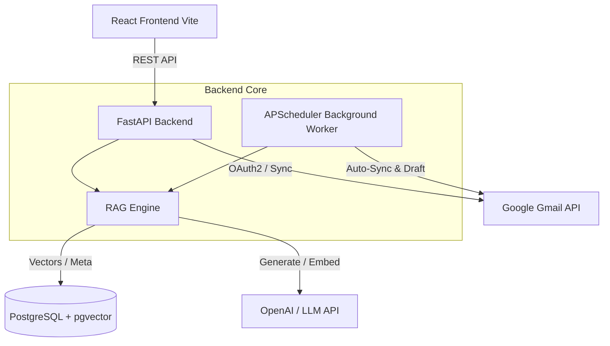
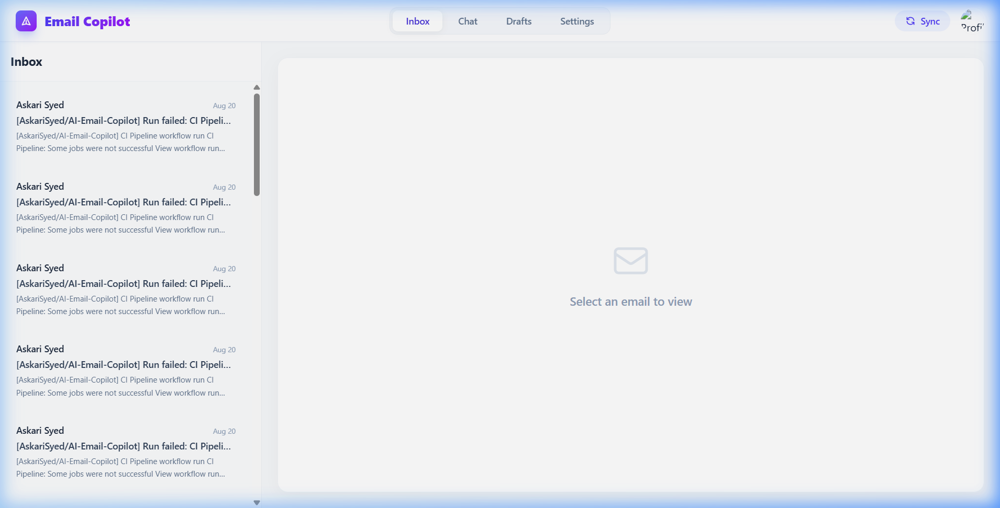
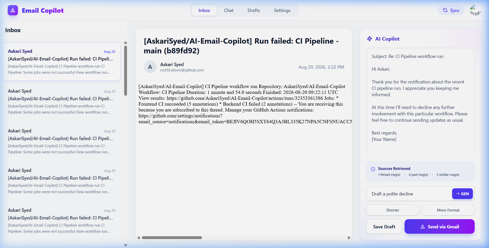
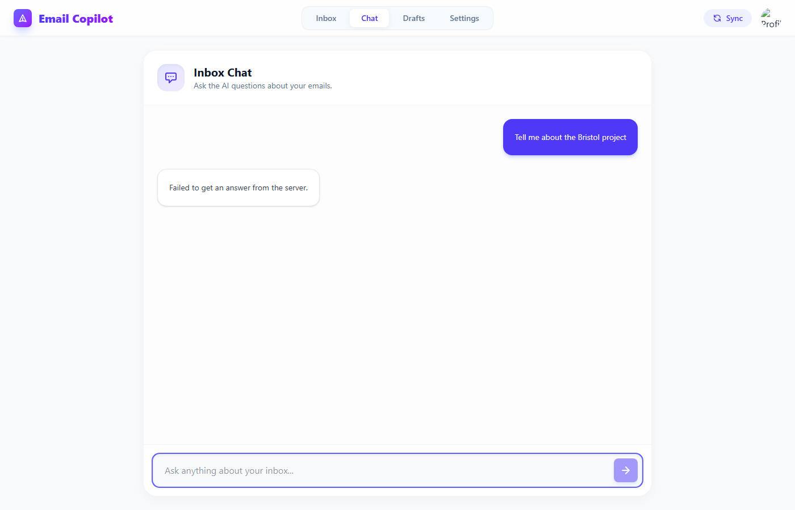

# AI Email Copilot

[](https://github.com/AskariSyed/AI-Email-Copilot/actions/workflows/ci.yml)

> An intelligent, context-aware AI assistant that plugs directly into your Gmail account, learning your communication style to autonomously draft personalized responses.

AI Email Copilot is a production-grade web application designed to supercharge your email productivity. By integrating securely with Gmail via official Google APIs and leveraging Retrieval-Augmented Generation (RAG), the copilot understands your unique communication patterns. It autonomously drafts highly accurate, context-aware replies for incoming emails, allowing you to breeze through your inbox.

---

## 🚀 Key Features

### 1. Gmail OAuth2 & API Integration
Securely authenticate and sync your inbox using official Google APIs. Your emails are fetched directly from Google's servers using OAuth2, ensuring your credentials are never stored.

### 2. RAG-Powered Personalized Email Generation
The AI reads past threads and similar historical emails using vector embeddings. By retrieving this context, it matches your exact tone, phrasing, and context, generating drafts that sound like *you*.

### 3. Background Draft Generation
Powered by `APScheduler`, a background worker continuously syncs your inbox and autonomously pre-generates drafts for your most recent incoming emails—so they are ready before you even open them.

### 4. Multi-Account Support
Link multiple Gmail accounts simultaneously. The system seamlessly isolates data and allows you to switch between different inboxes instantly.

### 5. AI Inbox Assistant (Chat)
A dedicated chat interface to talk directly to your inbox. Ask questions like *"What was the latest on the Q3 report?"* and receive intelligent answers with clickable source citations referencing your actual emails.

### 6. Communication-Style Profiling
A dual-layer personalization engine that manually accepts your instructions while autonomously inferring your Formality, Tone, Conciseness, and more from your past sent emails.

### 7. Prompt Injection Defenses
Employs structural data isolation, XML delimiters, output validation, and a strict human-in-the-loop design to heavily mitigate prompt injection risks from untrusted emails.

---

## 🏗️ High-Level Architecture

The system follows a modern decoupled architecture:



### RAG Pipeline Explanation
1. **Ingestion**: When emails are synced, they are cleaned, chunked, and embedded using an embedding model (e.g., `text-embedding-3-small` or `all-MiniLM-L6-v2`).
2. **Storage**: The embeddings are stored in PostgreSQL using the `pgvector` extension for lightning-fast similarity search.
3. **Retrieval**: When a new email arrives, the RAG engine performs a cosine similarity search against your past sent emails to find a broad set of candidate emails.
4. **Thread Reconstruction**: The system resolves isolated email chunks back to their parent threads and reconstructs the entire chronological conversation to provide accurate context and eliminate duplicates.
5. **Reranking**: A local Cross-Encoder model precisely scores and reranks the candidate threads, ensuring only the absolute most relevant conversations are selected.
6. **Generation**: The top-ranked context, along with the current email thread and your global style instructions, are passed to the LLM (e.g., `gpt-4o-mini`) to generate a highly accurate draft.

---

## 🛠️ Technology Stack

- **Frontend**: React 18, Vite, TypeScript, TailwindCSS v4
- **Backend**: FastAPI, Python, SQLAlchemy, Alembic, APScheduler
- **Database**: PostgreSQL with `pgvector` extension
- **AI/LLM**: OpenAI API (GPT models & Embeddings)
- **Infrastructure**: Docker & Docker Compose

---

## 🔒 Security & Privacy Considerations

- **Local Vectorization**: Your emails are stored securely in your own PostgreSQL database. We do not train public LLMs on your data.
- **Minimal RAG Payload**: Only the most relevant, highly-scored snippets of context are injected into the prompt at runtime.
- **Secure Rendering**: Incoming rich HTML emails are rendered in a strict `sandbox` iframe to prevent Cross-Site Scripting (XSS) and isolate malicious scripts.
- **OAuth2 Standard**: The application relies strictly on standard OAuth2 flows. User passwords are not stored.

---

## 📂 Project Structure

For a deep dive into the implementation, please see the [Architecture Documentation](docs/architecture.md).

```
.
├── backend/                  # FastAPI backend server
│   ├── app/                  # Application code (API, Core, Models, Services)
│   ├── alembic/              # Database migration scripts
│   ├── tests/                # Pytest unit & integration tests
│   ├── requirements.txt      # Python dependencies
│   └── .env.example          # Example environment variables
├── frontend/                 # React frontend application
│   ├── src/                  # Source code (Components, API clients)
│   ├── public/               # Static assets
│   ├── package.json          # Node dependencies
│   └── tailwind.config.js    # Tailwind configuration
└── docker-compose.yml        # PostgreSQL Database infrastructure
```

---

## 📸 Screenshots & Demo

| Inbox Sync & Viewing | AI RAG Draft Generation | AI Chat Assistant |
|:---:|:---:|:---:|
|  |  |  |

---

## ⚙️ Local Development Setup

### Prerequisites
- Node.js (v18+)
- Python (3.10+)
- Docker & Docker Compose
- A Google Cloud Console project with the Gmail API enabled & OAuth2 credentials.
- An OpenAI API Key (or equivalent LLM provider).

### 1. Database Setup (Docker)
The easiest way to run the database is via the provided `docker-compose.yml`. This spins up a PostgreSQL instance with the `pgvector` extension pre-installed.

```bash
docker-compose up -d
```

### 2. Environment Variables
Navigate to the `backend/` directory and copy the example environment file:
```bash
cd backend
cp .env.example .env
```
Update `.env` with your actual credentials:
- `DATABASE_URL`: Ensure this points to your running `pgvector` instance.
- `GOOGLE_CLIENT_ID` & `GOOGLE_CLIENT_SECRET`: From your Google Cloud Console.
- `LLM_API_KEY` & `EMBEDDING_API_KEY`: Your AI provider keys.

### 3. Backend Setup
Create a virtual environment, install dependencies, and run migrations:
```bash
# In the backend/ directory
python -m venv .venv

# Activate virtual environment
# On macOS/Linux: source .venv/bin/activate
# On Windows: .venv\Scripts\activate

pip install -r requirements.txt

# Run database migrations
alembic upgrade head

# Start the FastAPI server
uvicorn app.main:app --reload --port 8000
```
The API will be accessible at `http://localhost:8000`.

### 4. Frontend Setup
Open a new terminal, navigate to the `frontend/` directory, and start the development server:
```bash
cd frontend
npm install
npm run dev
```
The application will be available at `http://localhost:5173`.

---

## 📚 API Documentation
Once the backend is running, FastAPI automatically generates interactive OpenAPI documentation. You can access it at:
- **Swagger UI**: `http://localhost:8000/docs`
- **ReDoc**: `http://localhost:8000/redoc`

---

## 🔬 Scientific RAG Evaluation

AI Email Copilot includes a robust evaluation framework located in `backend/evaluation/` to scientifically measure the quality of Retrieval-Augmented Generation. 

### Methodology
The framework splits evaluation into two isolated components to ensure precision:
1. **Deterministic Retrieval Metrics**: Measures how well the `pgvector` semantic search finds the right chunks using **Hit Rate**, **Recall@K**, and **Mean Reciprocal Rank (MRR)**.
2. **LLM-as-a-Judge Generation Metrics**: Evaluates the final drafted response using an LLM to score (1-5) on **Context Relevance**, **Groundedness** (hallucination check), **Answer Relevance**, and **Concept Coverage**.

### Running Evaluations
To run an evaluation, populate real test cases in `backend/evaluation/dataset_format.json`, matching your database's actual chunks:

```json
[
  {
    "id": "test_1",
    "type": "draft",
    "input_text": "When is the project deadline?",
    "sender": "boss@company.com",
    "expected_chunk_ids": [12, 45],
    "expected_concepts": ["Friday", "End of day"]
  }
]
```

Then, run the evaluation script from the `backend/` directory:
```bash
python evaluation/run_evals.py
```
This outputs an aggregate summary to your terminal and saves a detailed, machine-readable `results.json` file containing reasoning for every score.

---

## 🧪 Testing

The project utilizes automated testing across both the frontend and backend to ensure reliability without requiring real API keys or Gmail accounts.

### Backend Testing (`pytest`)
Backend tests heavily mock external services (OpenAI, Gmail API, PostgreSQL) and utilize an in-memory SQLite database. Tests cover Gmail sync parsing, Retrieve & Rerank logic, prompt injection filters, and API endpoints.

To run backend tests and measure coverage:
```bash
cd backend
python -m pytest tests/ --cov=app
```

### Frontend Testing (`vitest`)
Frontend tests utilize `vitest` and `@testing-library/react` to render the UI components in a jsdom environment, mocking all API calls.

To run frontend tests:
```bash
cd frontend
npm test
```

---

## 🤝 Contributing

### Frontend Linting & Build Checks
The frontend uses `oxlint` for linting and `tsc` for type checking.

```bash
cd frontend
npm run lint
npm run build
```

---

## 🔮 Future Improvements

- [ ] **Thread Summarization**: Auto-generate brief summaries for long email chains.
- [ ] **Analytics Dashboard**: View statistics on emails processed, time saved, and response rates.
- [ ] **Local LLM Support**: Expand support to local models (e.g., via Ollama) for 100% offline and private generation.
- [ ] **Calendar Integration**: Allow the AI to check availability and automatically propose meeting times.

---

## 📝 License
This project is open-source and available under the MIT License.

## 👥 Author
**Askari Syed**
*AI Email Copilot - Supercharging your inbox with Context-Aware AI.*
