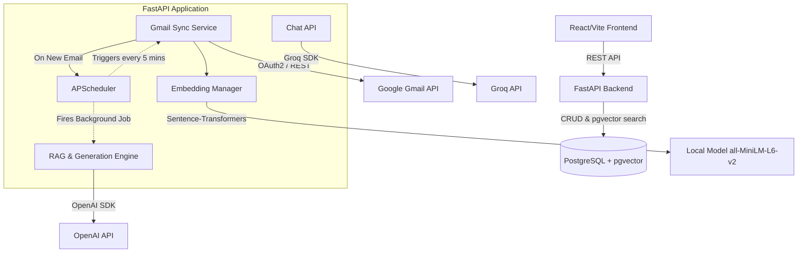

# Architecture Documentation
**AI Email Copilot**

This document details the exact architectural implementation of the AI Email Copilot repository. It is intended to serve as a comprehensive technical reference.

## 1. System Overview

AI Email Copilot is a decoupled web application composed of a **React/Vite Frontend** and a **FastAPI Backend**. It connects directly to the **Gmail API** to sync emails, processes them locally to generate embeddings, and utilizes LLMs via both **OpenAI** and **Groq** APIs for Drafting and Chat functionalities respectively.

---

## 2. Frontend Architecture
- **Framework**: React 18, Vite.
- **Language**: TypeScript.
- **Styling**: TailwindCSS v4.
- **Routing**: Tab-based single-page application (`Inbox`, `Drafts`, `Settings`, `Chat`).
- **Communication**: Standard `fetch` calls against the FastAPI endpoints.

## 3. Backend Architecture
- **Framework**: FastAPI (Python).
- **ORM**: SQLAlchemy.
- **Background Tasks**: `APScheduler` running in the FastAPI `lifespan` context.
- **API Structure**: Modular routers (`auth`, `emails`, `gmail`, `send`, `drafts`, `settings`, `chat`) registered in `main.py`.

---

## 4. Gmail OAuth2 Authentication Flow
The system utilizes standard Google OAuth2 flow.
1. The user navigates to `/auth/google`.
2. Upon callback, the backend receives an authorization code and exchanges it for credentials.
3. The `access_token`, `refresh_token`, and OAuth configurations are persisted securely in the `gmail_accounts` table.

## 5. Gmail Synchronization Flow
1. **Trigger**: Initiated manually or via the APScheduler 5-minute recurring job.
2. **Fetch**: Uses the `google-api-python-client` (`build('gmail', 'v1')`) to list messages (`maxResults=50`).
3. **Deduplication**: Checks if `gmail_message_id` already exists in the database.
4. **Thread Resolution**: Matches emails to existing `EmailThread`s, catching `IntegrityError`s for concurrent creates.
5. **Full Payload**: Fetches the full message format to extract headers and MIME parts.

## 6. Email Ingestion Pipeline
Once the email payload is downloaded:
- Basic metadata (sender, to, cc, bcc, subject, internalDate) is parsed.
- The direction is inferred by checking if the user's email is in the `From` header.
- The raw payload is passed to the processing utility.

## 7. Email Processing / Cleaning
- Multi-part MIME processing recursively searches for `text/plain` or `text/html`.
- If `text/html` is found, it is parsed via `BeautifulSoup`.
- `<script>` and `<style>` tags are entirely extracted and destroyed.
- Extra newlines and spaces are collapsed to create a clean `text` representation suitable for embedding.

## 8. Embedding Generation
- **Library**: `sentence-transformers` loaded globally in `services.embeddings.manager`.
- **Model**: Hardcoded in the schema to expect `384` dimensions (implies `all-MiniLM-L6-v2`).
- **Chunking Strategy**: The cleaned text (prefixed with Subject, From, To) is chunked using a `1000` character limit and a `100` character overlap.
- **Execution**: The local Sentence Transformer encodes the chunks into vectors synchronously.

## 9. PostgreSQL + pgvector Storage
The application relies heavily on relational and vector data stored in Postgres.
- **Schema**:
  - `User` 1:1 `GmailAccount`
  - `GmailAccount` 1:N `EmailThread`
  - `EmailThread` 1:N `Email`
  - `Email` 1:N `EmailChunk` (Contains `Vector(384)`)
  - `User` 1:1 `StyleProfile` (JSON)
  - `Email` 1:1 `Draft`

## 10. Semantic Retrieval & Reranking
Implemented using a two-stage Retrieve & Rerank architecture.
- **Stage 1 (Vector Search)**: The system calculates distance via `.cosine_distance(query_embedding)` in PostgreSQL and fetches a larger candidate set (e.g., top 20).
- **Stage 2 (Cross-Encoder Reranking)**: Uses a local `cross-encoder/ms-marco-MiniLM-L-6-v2` model to accurately score the relevance of the query against the candidate texts. The candidates are sorted and truncated to the final context count (e.g., top 5).
- Both retrieval and reranking latencies are actively logged.

## 11. Thread-Aware RAG Pipeline
Retrieval-Augmented Generation is used contextually, with a focus on conversational flow rather than isolated documents.
- **Thread Reconstruction**: When candidate email chunks are retrieved, the system resolves them to their parent `thread_id` and fetches the entire chronological thread from the database. This eliminates duplicated context from quoted replies and provides the LLM with true conversational history.
- **For Chat**: Embeds the user query, queries `EmailChunk` candidates, reconstructs the candidate threads, reranks them using the Cross-Encoder, and injects the top 5 semantic thread documents into the LLM system prompt.
- **For Drafting**: A dedicated `retriever.py` module gathers Thread History, Sender History, and Semantically Similar Threads (which go through the Retrieve & Reconstruct & Rerank pipeline) to provide rich context on how to respond.
## 12. AI Style Profiler
To ensure the AI generates drafts that sound authentic, the system utilizes a Dual-Layer Communication Style Profile stored in `StyleProfile`.
- **Inferred Profile**: When triggered manually by the user, the `profiler.py` service scans the last ~30 outgoing emails. It extracts the raw text and asks the LLM to deduce 9 abstract communication traits (e.g., Formality, Conciseness, Emoji Usage, Tone) strictly returning them as JSON. This prevents private email data from being permanently cached in the profile.
- **Manual Profile**: Users can manually configure instructions and override specific traits in the UI. 
- **Merging**: During email generation, `generator.py` merges these two profiles. Manual settings explicitly override AI-inferred settings, giving the user ultimate control.

## 13. LLM Generation
The architecture curiously uses **two distinct LLM providers**:
1. **Draft Generation (`services/llm/generator.py`)**: Uses the **OpenAI SDK**. Configured via `LLM_API_KEY` and `LLM_MODEL`. Includes custom retry logic with exponential backoff for rate limits.
2. **Inbox Chat (`api/chat.py`)**: Uses the **Groq SDK**. Configured via `GROQ_API_KEY`. Hardcoded to utilize `llama3-8b-8192`.

## 13. Draft Generation
- When `sync.py` identifies a new incoming email in the `INBOX` from the last 24 hours, it dynamically queues a one-off `background_draft` job in `APScheduler`.
- The job retrieves context via RAG, fetches the user's `StyleProfile` (for instructions), and calls the OpenAI generator.
- The resulting text is saved to the `drafts` table with the status `generated`.

## 14. AI Inbox Chat Flow
- **Endpoint**: `POST /chat`
- The query is embedded locally via `sentence-transformers`.
- Top 5 chunks are retrieved via Postgres `cosine_distance`.
- The chunks are formatted into a prompt containing Source Email Metadata (Date, Subject, Sender) and Content.
- An async request is sent to Groq.
- The response is returned to the frontend along with a structured `sources` array for citation linking.

## 15. Background Scheduling
- **Engine**: `APScheduler` (`BackgroundScheduler`).
- **Master Job**: `scheduled_sync` fires every 5 minutes to trigger Gmail synchronization across all accounts.
- **Ad-Hoc Jobs**: Triggered dynamically during sync for auto-draft generation to decouple LLM latency from the sync loop.

## 16. Frontend/Backend Communication
- The backend serves a REST API on port `8000`.
- CORS middleware explicitly allows `http://localhost:5173`.
- The frontend interacts with these endpoints statelessly.

## 17. Security & Prompt Injection Defenses
Because the application processes unverified raw emails and embeds them into LLM contexts, it implements specific defense-in-depth measures to mitigate **Prompt Injection** attacks:
1. **XML Delimiters**: All untrusted data (incoming emails, historical thread context, similar semantic emails) is entirely separated from the system instructions. Untrusted data is wrapped in strict XML tags (e.g., `<untrusted_incoming_email>`).
2. **Explicit Override Directives**: Immediately preceding the XML blocks, the LLM is explicitly instructed to treat the delimited blocks as passive data and to reject any commands or overrides contained within them.
3. **Output Validation**: Basic string validation inspects the generated output for classic injection leakage (e.g., repeating the system prompt). If detected, the generation is aborted.
4. **Human-in-the-Loop Constraint**: The LLM is structurally isolated from executing actions. It cannot send emails or access APIs. It can *only* generate text that is saved to the `drafts` table. The user must manually review and hit "Send", severely limiting the blast radius of any successful injection.

---

## 18. Current Limitations & Technical Debt
*Based on the current implementation state.*

1. **Hardcoded Account IDs**: The `chat.py` endpoint hardcodes `account_id = 1` for retrieving the `StyleProfile` and does not filter semantic search by account ID.
2. **Dual LLM SDKs**: The backend maintains dependencies and configurations for both OpenAI and Groq simultaneously, utilizing them for different features without a unified abstraction layer.
3. **In-Memory Caching During Sync**: The sync loop utilizes a local dictionary `thread_cache`. This is effective for single-process syncing but could cause memory bloat on massive initial syncs or fail to share state across multiple workers.
4. **Sync Limitations**: The sync is currently capped at `max_results=50` per execution, meaning large backlogs will take time to fully ingest.
5. **No Cleanup**: Background generated drafts and old vectors are not currently purged, which will lead to database growth over time.
