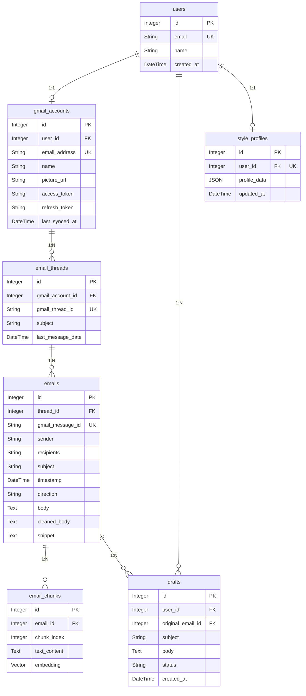

# Database Schema & Architecture

This document outlines the PostgreSQL database schema for AI Email Copilot, including relationships, indexing strategies, and performance considerations.

## Entity-Relationship Diagram



## Tables & Relationships

### Core Identity
* **`users`**: The central application identity.
* **`gmail_accounts`**: Stores OAuth credentials, refresh tokens, and sync states. Bound 1:1 to a User.
* **`style_profiles`**: Stores the AI persona configuration (manual overrides + inferred habits). Bound 1:1 to a User.

### Email Synchronization
* **`email_threads`**: Represents a continuous conversation in Gmail. Enforces uniqueness on `gmail_thread_id`.
* **`emails`**: Represents an individual message. Belongs to a Thread. Contains original HTML, cleaned plaintext, and routing metadata. Enforces uniqueness on `gmail_message_id` to prevent duplicate ingestion.

### AI & Retrieval
* **`email_chunks`**: Breaks down `emails.cleaned_body` into ~1000 character overlapping chunks. Contains a `vector(384)` column generated by `all-MiniLM-L6-v2`.
* **`drafts`**: Stores AI-generated responses linked to the user and the original incoming email.

## Performance & Indexing Strategy

### Vector Search
`pgvector` performs exact k-nearest neighbor (KNN) searches by default (a sequential full-table scan). To enable sub-millisecond retrieval across hundreds of thousands of email chunks, we enforce an **HNSW** (Hierarchical Navigable Small World) index using the `vector_cosine_ops` operator class on `email_chunks.embedding`.

### Foreign Key B-Trees
PostgreSQL does not index foreign keys by default. We enforce explicit B-Tree indexes on heavily queried relations:
* `emails.thread_id`: Critical for rapidly reconstructing conversation context during RAG.
* `email_chunks.email_id`: Critical for the background sync worker determining which emails lack embeddings.

## Migration Strategy
Database migrations are strictly handled via **Alembic**.
To run pending migrations against the database:
```bash
cd backend
alembic upgrade head
```
